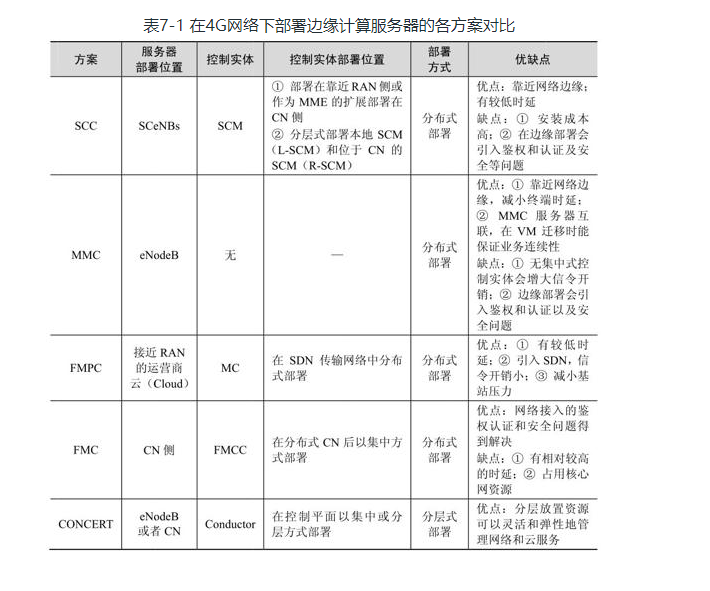

# 边缘计算原理与实践
## 边缘计算移动性管理
### 关键技术
#### 迁移决策
#### 迁移执行
#### 流量更新规则
用户设备从一个结点到另一个结点，或用户设备改变之后，移动边缘主机能够通过正确的无线访问结点和正确的通道将流量路由到用户设备，流量导向错误的结点会对UE的服务质量造成影响，为此更新流量规则是必要的
#### 终止应用程序
### 主要挑战
#### 迁移决定策略
#### 预迁移
#### 迁移组
## 边缘计算安全与隐私保护
### 概述
新型MEC的攻击方式有：  
（1）网络设施攻击：拒绝服务、中间人、恶意网关
（2）服务设施攻击：隐私泄露、权限升级、服务复制、恶意结点
（3）虚拟化设施攻击攻击：拒绝服务攻击、资源错误使用、隐私泄露、权限升级、虚拟机复制
（4）用户终端攻击：信息注入、服务复制
### 关键技术
（1）身份验证与鉴权技术：对每一个实体进行验证，实体之间也需要验证，所以需要开发一种联合身份验证方法以及无需中心服务器验证的去中心化验证方法
（2）协议与网络安全技术：需要对MEC种种通信技术和协议进行有效的防护  
（3）信任管理技术：包括实体身份的验证、对交互实体数量和具体行为的管理，以此来提高实体间交互的成功率和准确率，提高个人数据的管理  
（4）入侵检测技术：MEC结点主要为本地提供服务，所以大多数攻击都被限制在结点附件，MEC结点嫩巩固对其中的网络连接进行、虚拟状态等结点多拥有的部分进行监控  
面临挑战：无法充分了解特定攻击方式、在本地防御和全局防御之间平衡点的掌握、全局监控机制的建立、检测机制如何尽可能采用自治的方式进行  
（5）隐私保护技术：多个设备域被不同设备拥有者所管理，造成非常严重的隐私问题  
（6）错误容忍与恢复技术：面对错误容忍与回复技术一方面保护机制能够利用多种设备提供商在同一个地方都可用的优点，另一方面由于服务在本地提供，有可能没有替代服务可用
## 边缘计算的部署方案
### 概述
部署位置比较灵活，LTE宏基站侧、3G无线网络控制器侧、多无线接入技术、蜂窝汇聚点侧或核心网边缘
### 4G架构下的MEC部署

### 5G架构下的MEC部署

*5G系统架构图*  
1. 三层逻辑划分
   1. 最下层：接入层（UE、AN）和用户平面功能、数据网络功能等数据层相关组件
   2. 中间层：认证服务器功能、接入管理功能、会话管理功能为代表的控制核心层
   3. 最上层：网络存储功能、策略控制功能、统一数据管理和网络切片选择功能、网络开放功能、应用功能为代表的网络能力相关开关的服务
MEC位于核心网与接入网融合的部分，通过网络开放功能（NEF）接入5G网络。用户请求通过用户平面功能（UPF）到达MEC，在策略控制功能（PCF）的管控下，MEC为用户提供各种各样的缓存、计算和网络服务。MEC在具体部署方式上也非常灵活，既可以选择集中部署，与用户面设备耦合，提供增强型网关功能，也可以分布式地部署在不同位置，通过集中调度实现服务能力。
## 边缘计算使能技术
### 概述
### 软件定义网络
### 网络功能虚拟化
### 信息中心网络
### 云计算与数据中心网络
### 大数据
### 区块链

## 边缘计算应用场景实例
### 概述
### 视频业务
#### 智能视频加速

#### 内容缓存与分发
将本地服务或非常流行的内容部署或高速缓存在靠近用户请求的位置，如果申请访问的内容存在于本地的缓存中则直接将缓存内容推向请求的终端  
缓存存了存视频还要存不同比特率版本的视频以此满足对不同设备的需要，为此不仅要命中视频内容还要命中视频的比特率版本，当没有命中比特率版本时可以通过比特率转化将高比特率变为低比特率
### 增强现实/虚拟现实

### 物联网
由于物联网设备在处理器和内存容量方面通常是资源受限的，并且物联网连接有大量设备，会产生大量流量，所以需要MEC服务器连接到靠近设备的移动网络来收集各种物联网设备信息，提供分析处理能力并降低延迟响应时间
### 车联网
### 工业互联网

*工业互联网平台架构*
## 边缘计算开源平台实践
### 概述
### 微云elijah项目
### Edge X Foundry
### M-CORD项目
### AKraino项目

