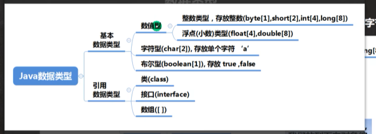
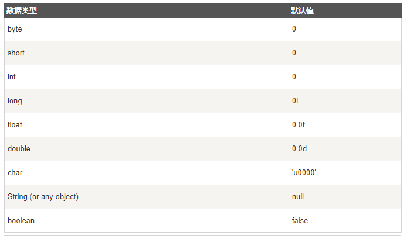
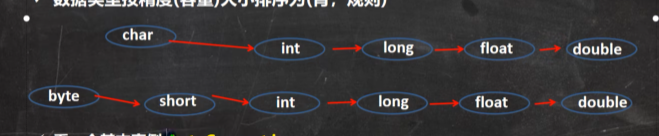
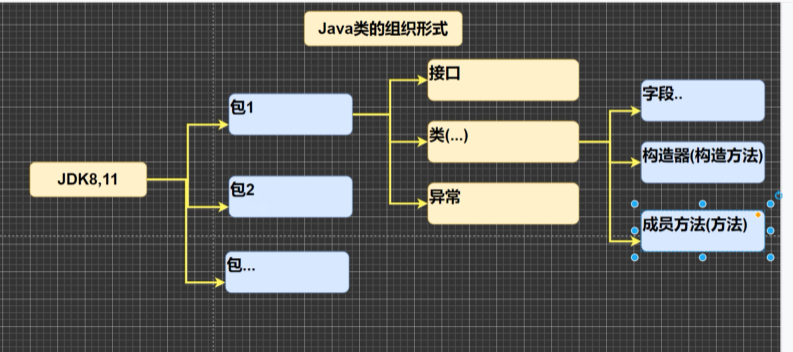

# java数据类型

*java数据类型*
## 基本数据类型
6+1+1：byte+short+int+long+float+double+char+boolean
基本数据类型的默认值

### 浮点型
**注意**：浮点数常量默认值为double，声明常量，必须后面加'f'或者‘F'  
可以把小的空间放到大的空间，当我们不知道精度的时候推荐使用double
浮点数使用陷阱（重要使用点）：但我们的运算结果是小数的时候，对计算结果相等判断的时候要小心。应该是以两个书差值的绝对值，在某个精度范围内判断
```java
if(Math.bas(num11-num12)<0.0000001){
     
}
```
**细节**：如果直接查询或者直接复制，可以判断相等
### 字符类型char
字符类型细节：
1. 常量用单引号
2. 允许转义字符
3. java中char本质是一个整数
4. 直接给char赋值一个整数，输出时，对按照unicode输出对应字符，如果要输出数字在前面加上int
5. char类型可以进行运算，因为相当于一个整数
### 数据类型转换
#### 自动类型转换
* 当java进行赋值或者运算时，精度小的类型自动变为精度大的类型
* 数据类型按照精度大小排序为  

**自动类型转换细节**
* 多种类型的数据混合运算时，系统首先会自动将所有数据转化为容量最大那种数据类型，然后再进行计算
* 当我们把精度大的数据赋值给精度小的数据类型时，会报错，反之就会自动类型转换
* （byte、short）和char之间不会自动转换
* byte，short,char他们三者可以计算，计算时首先转为int类型
* boolean类型不参与转换
* 自动提升原则：表达式结果的类型自动提升为操作数中最大的类型
### 强制类型转换

## 引用类型
类、数据、接口  
所用应用类型的默认值都是null
# java的API文档
[中文网址](matools.com)
## Java类的组织形式

## 变量类型
### 局部变量
1. 存在与方法、构造方法、语句块中
2. 在栈上分配
3. 没有默认值，所以局部变量在声明后必须进行初始化
### 类变量
### 实例变量

