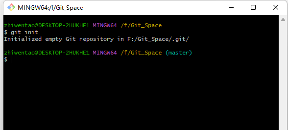
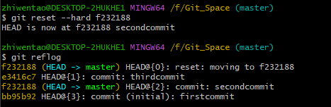

#GIT
## Git介绍
Git是分布式版本控制工具（免费开源）
分布式vs集中式：
Git易于学习，占地面积小，有廉价的本地库
1. 何为版本控制？
版本控制是一种记录文件内容变化，以便将来查阅特定版本修订情况的系统  
版本控制最重要的是记录文件修改的历史纪录，让用户能够查看历史版本，方便版本切换。
2. 为什么需要版本控制？
从个人开发到团队过渡
3. 版本控制工具
  1. 集中式版本控制工具
   有单一的集中管理服务器，保存所有文件的修订版本，从而协同工作的人都通过客户端连接到服务器，取出最新的文件或者提交更新。
   
   优点：管理员权限控制、便于集中化管理
   缺点：中央服务器单点故障，如果服务器宕机一小时，那么在一小时内，谁都无法提交更新，就无法协作。
  2. 分布式版本控制工具
   客户端不是提取最新版本的快照，而是把代码仓库完整的镜像下来，这样任何一处协同工作的文件发生故障，事后都可以用其他客户端的本地仓库进行恢复。客户端每次提取操作，都是对文件仓库的完整备份
   弥补缺陷：
   1. 断网情况下也可以进行开发，因为版本控制工具是在本地进行的
   2. 每个客户端保存的都是完整的项目（包含历史记录，更加安全）
4. git工作机制：
   

## Git安装
**注意事项**：
1. 安装目录不要有中文，不要有空格
2. 剩余安装默认即可
## Git命令

1. 设置用户名标签
   1. 基本语法
   ```git
   git config --global user.name zhiwentao //用于设置用户名
    git config --global user.email zwt13962936376ll@163.com //用于设置邮箱

   ```
   如何验证：在git.config文件中查看
   **说明**：用户签名用于区分不同的操作者，Git首次安装必须设置用户签名，否则不能提交代码
  **注意**：这里设置的用户签名和用来登录GitHub(或代码托管中心)的账号没有任何关系
2. 初始化本地库
如果要用git管理目录，则需要git获得目录的管理权
   1. 基本语法
   ```git
   git init
   ```
   进入文件目录后使用git init
   
   会在文件夹中生成.git文件夹，但是是隐藏文件
3. 查看本地库状态
   1. 基本语法
   ```git
   git status
   ```

   当创建一个文件之后，查看文件状态发现是红色，这表明文件还是在代码区，如果如果想追踪文件按则需要add到临时区
4. 文件添加暂存区
   1. 基本语法
   ```git
     git add hello.txt
   ```
   存完后再次查看，文件颜色变为绿色，这是可以被git追踪了  
   2. 其他事项
   存在与暂存区的文件是可以删除的，删除代码
   ```
    git rm --cached <file>
   ```
   当暂存区文件被删除时，代码区的文件并没有被删除，再次查看文件状态，文件会再次变为红色
5. 提交本地库
将暂存区的内容，提交到本地库中
  1. 基本语法
  ```git
   git commit -m "日志信息" 文件名
  ```
  
  2. 其他事项
   
   再次查看文件状态后，发现目前处于主分支上  
   查看版本信息
   ```git
   git reflog
   git log
   ```
   
   这两个方法可以看到文件日志的信息
6. 修改文件代码
   
   当文件修后，再次查看文件状态会变为红色
   添加到暂存区后变为绿色
   当添加到本地仓库后，后提示哪些地方被改变了
7. 历史版本
   1. 查看历史版本信息
   ```git
   git reflog//查看精简版本信息
   git log //查看版本信息
   ```
   2. 版本穿梭
   ```git
    git reset --hard 日志号
   ```
   

  
## Git分支

### 什么是分支
在版本控制的时候，同时推进多个任务，为每个任务，我们可以创建每个任务的单独分支，使用分支意味着程序员可以把自己工作从开发主线分离开来，开发自己分支的时候，不会影响主线分支的运行。（分支的底层也是指针的引用）
### 分支操作

1. 查看分支
   1. 语法
   ```
   git branch -v
   ```
   
   目前只有一个分支
2. 创建分支
   ```
    git branch 分支名
   ```
   
   有了两个分支，目前处于master分支
3. 修改分支
   
4. 切换分支
   1. 语法
   ```
   git checkout 分支名
   ```
   
   目前处于hot_fix分支
5. 合并分支
   1. 语法
   ```
   git merge 要合并的分支
   ```
   这里合并时成功的，因为只有一个分支对文件发生了修改，其他分支包括主分支并没有对文件进行修改
6. 产生冲突
  产生冲突的原因：两个分支在同一个文件的同一个位置有两套完全不同的修改。Git无法替换我们决定使用哪一个，必须人为决定代码内容
  
  当在master和hot-fix分支同时修改文件后，合并分支时会现实分支合并失败
7. 解决冲突
   1. 查看文件进行修改
   2. 再次提交到暂存区
   3. 再次提交到本地库
   **注意**：这次提交到本地库的时候，不需要加文件名，否则会报错
   
   报错情况
   
   不报错的情况
   合并分支，只会修改合并的那个分支，不会修改合并的那个分支（hot-fix合并到master只会修改master分支，不会修改hot-fix分支）
## Git团队协作机制
1. 团队内协作

2. 跨团队协作

## GitHub操作
### 创建远程仓库
### 远程仓库操作
1. 创建远程仓库别名
2. 推送本地分支到远程仓库
3. 克隆远程仓库到本地
4. 邀请加入团队
5. 拉去远程仓库内容
### 跨团队合作
### SSH免密登录
